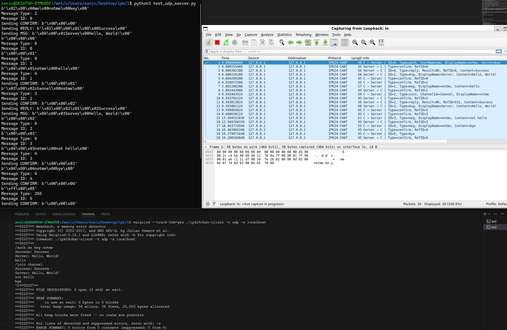
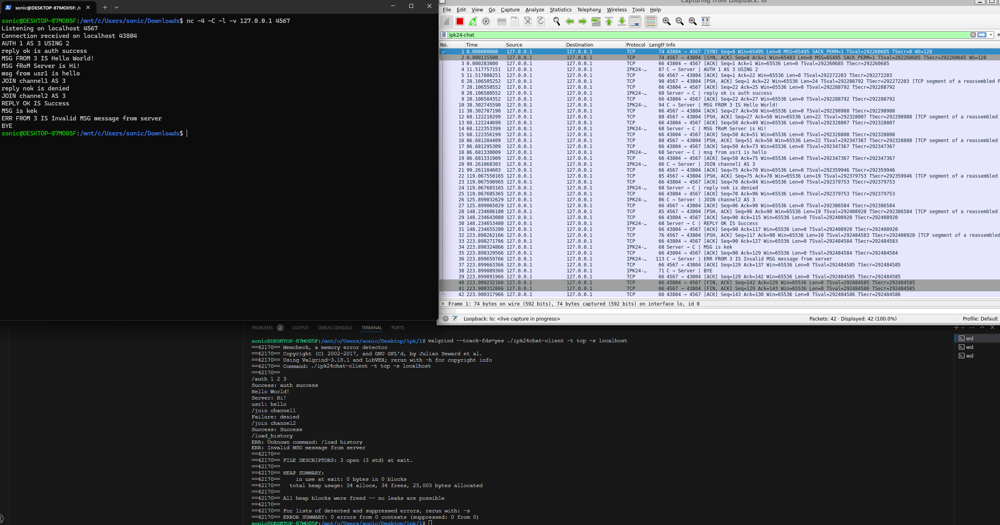

# Documentation for implementation of IPK Project 1: Client for a chat server using `IPK24-CHAT` protocol

This documentation covers the source code for a chat client implemented in C. The client supports both TCP and UDP protocols and allows users to connect to a server, authenticate, join a channel, send messages, and change their display name.

## Content Structuring

- [Documentation for implementation of IPK Project 1](#documentation-for-implementation-of-ipk-project-1-client-for-a-chat-server-using-ipk24-chat-protocol)
  - [Content Structuring](#content-structuring)
  - [Code Structuring](#code-structuring)
  - [Executive Summary](#executive-summary)
  - [Compilation](#compilation)
  - [Usage](#usage)
  - [Client Usage](#client-usage)
  - [Source Code Comments](#source-code-comments)
  - [Testing](#testing)
    - [Testing Description](#testing-description)
    - [Testing Examples](#testing-examples)
  - [Useful Links](#useful-links)
  - [Bibliography](#bibliography)
  
## Code Structuring

**main.c**: Contains the main function which is the entry point of the program. It handles argument parsing and converts the server name to IPv4.

**tcp.c**: Contains the implementation of the chat client using TCP. This includes functions for establishing a connection, sending and receiving messages, and handling errors.

**udp.c**: Contains the implementation of the chat client using UDP. Like tcp.c, it includes functions for establishing a connection, sending and receiving messages, and handling errors.

**help.c**: Contains helper functions that are used by both the TCP and UDP implementations. This could include functions for parsing commands, formatting messages, and handling timeouts.

**headers**: There are header files corresponding to each of the above .c files (e.g., main.h, tcp.h, udp.h, help.h). These files declare the functions that are implemented in the .c files.

**Makefile**: Used to compile the source code into a binary. It specifies the dependencies between the source files and the rules for compiling them.

Each of these components plays a crucial role in the functioning of the chat client. The main.c file is the starting point of the program, while tcp.c and udp.c implement the core functionality of the chat client for their respective protocols. The help.c file provides utility functions that are used throughout the codebase, and the header files declare the interfaces of the .c files. Finally, the Makefile automates the process of compiling the source code.

## Executive Summary

The chat client is a command-line application that communicates with a chat server. It supports both TCP and UDP protocols. The user can specify the protocol, server, port, timeout, and number of retransmissions as command-line arguments when starting the client.

## Compilation

This project can be compiled using Makefile:

```bash
make
```

## Usage

You can run client using following command:

```bash
./ipk24chat-client ipk24chat-client -t <protocol> -s <server> -p <port> -d <timeout> -r <retransmissions> -h
```

`-t` Protocol to use (tcp or udp)  
`-s` Server to connect to  
`-p` Port to connect to (default 4567)  
`-d` Timeout for retransmissions in ms (default 250ms)  
`-r` Number of retransmissions (default 3)  
`-h` Print usage  

> **Note**  
Only options `-t` and `-s` are mandatory and have to be always specified when running the program.

## Client Usage

/auth `username` `secret` `display_name`: Authenticate with the server.  
/join `channel_id`: Join a channel.  
/rename `display_name`: Change your display name.  
/help: Print help information.  

## Source Code Comments

The source code comments are written in English. They provide explanations of the code and document the purpose and parameters of functions.

## Testing

### Testing Description

The testing of the chat client involved running the client and connecting to a chat server. The functionality of each command was tested, and various edge cases were considered. For example, the client was tested with invalid command-line arguments, invalid commands, and invalid parameters for commands. The client was also tested with a server that disconnects unexpectedly.

All tests were executed on Windows Subsystem for Linux(Ubuntu), and the implementation works only on Linux.

### Testing Examples

#### UDP conversation between client and mock server



This conversation is testing various message types and responses. On the picture you can see what messages was sent from client and how it look on the server side, so we can see that client sends valid messages in terms of IPK24chat protocol.

#### TCP conversation between client and netcat server

  

Here you can see various usages of tcp protocol: authentication, sending message from client and from server, joining non-existing channel, joining existing channel, using wrong command and receiving wrong message from server and sending appropriate reaction on it.  
> **Note**
There are other packets that not under our protocol, those are for containing tcp connection.

## Useful links

[Socket programming](https://www.binarytides.com/socket-programming-c-linux-tutorial/)  
[IPK Lectures](https://www.youtube.com/playlist?list=PL_eb8wrKJwYv0INj2tRYT15csQXcKxTg1)  

## Bibliography

[1] Daniel Dolejška. IPK Project 1: Client for a chat server using `IPK24-CHAT` protocol. Available at: [IPK_project1]

[IPK_project1]: https://git.fit.vutbr.cz/NESFIT/IPK-Projects-2024/src/branch/master/Project%201